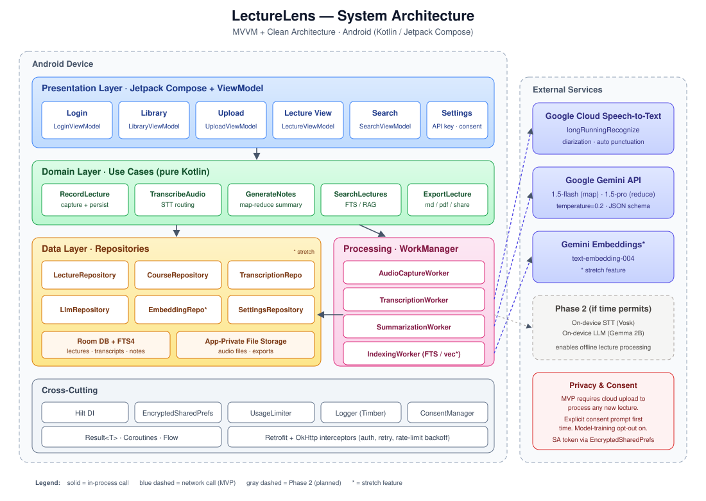
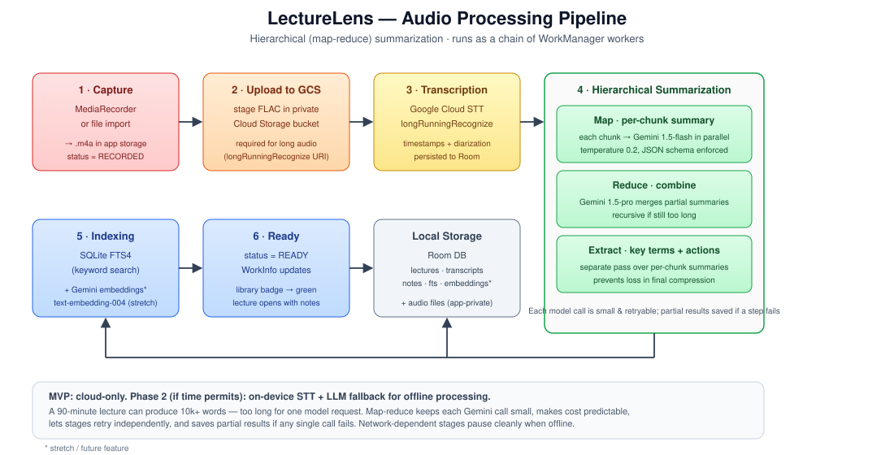

# LectureLens — Architecture Design

**Course:** CP-670 Android Application Programming
**Project:** LectureLens — Lecture to Notes Companion
**Date:** June 2026
**Authors:** Daniel Monday-Ogidi, Adeniyi Ridwan Adetunji, Muhammad Umer Amir, Zeeshan Mahmood, Aaron Gullraiz Cecil

---

## 1. Overview

LectureLens is an Android application that turns lecture audio into searchable, well-structured notes. The architecture is organized in three layers — **Presentation**, **Domain**, and **Data** — following the Android-recommended **MVVM + Clean Architecture** pattern. Heavy work (transcription, summarization, embeddings) is delegated to a thin **Processing Layer** that calls Google cloud services through repository interfaces, so providers can be swapped without touching app logic.

**MVP scope:** all speech-to-text and notes generation run in the cloud via Google services (Cloud Speech-to-Text + Gemini). An internet connection is required to process a new lecture. Already-processed lectures, transcripts, and notes remain viewable offline because they're cached locally.

**Phase 2 (time permitting):** on-device transcription and summarization fallback for offline processing and stronger privacy. The repository interfaces are designed so this slots in without changes to the UI, domain, or data layers.

### 1.1 Architectural Goals

| Goal | How the architecture addresses it |
|---|---|
| Offline review (MVP) | Local Room DB stores transcripts, summaries, and audio paths so reads never require network. New-lecture processing does require network in the MVP. |
| Cloud reliability | Both STT and LLM run on Google's managed services — no on-device model footprint in the MVP. |
| Provider flexibility | All STT, LLM, and embedding calls go through repository interfaces, so an on-device or alternate provider can be added later without app-logic changes. |
| Long-lecture support | Background `WorkManager` jobs run map-reduce summarization in chunks. |
| Privacy & consent | Audio leaves the device for cloud processing — the user sees an explicit consent prompt before the first upload and a per-lecture indicator afterward. |
| Testability | Domain layer is pure Kotlin; data sources are mockable behind interfaces. |

### 1.2 Technology Stack

The app targets Android 10+ (API 29) and is written in Kotlin with Jetpack Compose for the UI, Hilt for dependency injection, Room for local persistence, and WorkManager for background processing. **Google Cloud Speech-to-Text** handles all transcription and **Google Gemini** (via the Google AI / Vertex AI SDK) handles all summarization, note generation, and — for the stretch RAG feature — embeddings. There is no on-device transcription or LLM inference in the MVP. Retrofit + OkHttp wrap the REST calls, ExoPlayer handles audio playback, and the MediaRecorder API handles capture. FTS4 (built into SQLite) powers full-text search in the MVP, with an SQLite vector extension reserved for the stretch RAG feature.

---

## 2. High-Level Architecture



The system is split into four concerns:

**Presentation Layer (UI)** — Jetpack Compose screens (Login, Library, Upload, Lecture View, Search) backed by ViewModels that expose `StateFlow` to the UI. ViewModels never touch data sources directly; they call use cases.

**Domain Layer (Use Cases)** — Pure Kotlin classes that encapsulate one action each: `RecordLectureUseCase`, `TranscribeAudioUseCase`, `GenerateNotesUseCase`, `SearchLecturesUseCase`, `ExportLectureUseCase`. They orchestrate repositories but contain no Android dependencies, which makes them unit-testable on the JVM.

**Data Layer (Repositories)** — `LectureRepository`, `CourseRepository`, `TranscriptionRepository`, `LlmRepository`, `EmbeddingRepository`. `LectureRepository` and `CourseRepository` are backed by Room; `TranscriptionRepository`, `LlmRepository`, and `EmbeddingRepository` are backed by Retrofit clients calling Google services. The interfaces leave room for an on-device implementation in Phase 2. A `Result<T>` wrapper carries success, error, and loading states up the stack.

**Processing Layer (Background)** — `WorkManager` workers run the audio → transcript → summary → embeddings pipeline outside the UI lifecycle, so the user can leave the screen while a 90-minute lecture processes.

---

## 3. Detailed Component Design

### 3.1 Presentation Layer

```
ui/
├── auth/         LoginScreen, LoginViewModel
├── library/      LibraryScreen, LibraryViewModel        (course/lecture list)
├── upload/       UploadScreen, UploadViewModel          (record/import + progress)
├── lecture/      LectureViewScreen, LectureViewModel    (player, transcript, notes)
├── search/       SearchScreen, SearchViewModel          (FTS + future RAG)
└── settings/     SettingsScreen                         (API key, consent, model)
```

Each ViewModel exposes a single `UiState` sealed class — `Loading`, `Success(data)`, `Error(message)` — observed by Compose via `collectAsState()`. One-shot events (navigation, snackbars) flow through a `SharedFlow` to avoid re-emission on configuration change.

### 3.2 Domain Layer

Use cases are the only place business rules live. For example, `GenerateNotesUseCase` decides whether a transcript is short enough for a single LLM call or needs hierarchical map-reduce. This keeps the rule in one place and out of the ViewModel.

```kotlin
class GenerateNotesUseCase(
    private val llm: LlmRepository,
    private val chunker: TranscriptChunker
) {
    suspend operator fun invoke(transcript: Transcript): Result<Notes> {
        return if (transcript.wordCount <= SINGLE_PASS_LIMIT) {
            llm.summarize(transcript.text)
        } else {
            mapReduceSummarize(transcript)
        }
    }
}
```

### 3.3 Data Layer

**Room schema (MVP):**

| Table | Key columns |
|---|---|
| `courses` | id, name, color, created_at |
| `lectures` | id, course_id (FK), title, date, audio_path, duration_ms, status |
| `transcripts` | lecture_id (FK), full_text, language, model_used |
| `transcript_segments` | id, lecture_id (FK), start_ms, end_ms, text |
| `notes` | lecture_id (FK), summary, key_terms (JSON), action_items (JSON) |
| `transcripts_fts` | virtual FTS4 table mirroring transcript text for search |
| `embeddings` *(stretch)* | chunk_id, lecture_id, vector (BLOB), text |

`status` on `lectures` is an enum (`RECORDED`, `TRANSCRIBING`, `TRANSCRIBED`, `SUMMARIZING`, `READY`, `FAILED`) so the UI can show per-lecture progress on the library screen.

**Repository pattern:**

```kotlin
interface TranscriptionRepository {
    suspend fun transcribe(audio: File, options: TranscribeOptions): Result<Transcript>
}

class GoogleCloudTranscriptionRepository(...) : TranscriptionRepository { ... }
// class OnDeviceTranscriptionRepository(...) : TranscriptionRepository { ... }  // Phase 2
```

In the MVP, Hilt binds `TranscriptionRepository` directly to `GoogleCloudTranscriptionRepository`. A `TranscriptionRouter` is reserved for Phase 2, when an on-device implementation is added — at that point the router picks the implementation based on user setting and connectivity, and the change is contained in the DI graph.

### 3.4 Processing Layer (Pipeline)



The pipeline runs as a chain of `WorkManager` workers so each stage is retryable, cancellable, and survives process death.

1. **AudioCaptureWorker** — writes a FLAC/AAC file to app-private storage, inserts a `lectures` row with status `RECORDED`.
2. **TranscriptionWorker** — requires network. Uploads the audio to a private Cloud Storage bucket and calls Cloud Speech-to-Text's `longRunningRecognize` (which supports lectures up to ~8 hours), polling the returned operation until results land. The response is persisted as timestamped `transcript_segments` with speaker tags when diarization is enabled.
3. **SummarizationWorker** — requires network. Runs the map-reduce flow against Gemini: each ~3k-token transcript chunk is summarized in parallel by `gemini-1.5-flash` (map), partial summaries are merged and re-summarized by `gemini-1.5-pro` (reduce), and a separate extraction pass pulls key terms and action items so they're not lost in the final compression. Gemini's structured-output / JSON-schema mode enforces the response shape.
4. **IndexingWorker** — runs locally. Writes transcript text into the `transcripts_fts` virtual table. Stretch: also computes Gemini embeddings (`text-embedding-004`) and writes the `embeddings` table.

Network-dependent workers are enqueued with `Constraints.Builder().setRequiredNetworkType(CONNECTED).build()`, so if the device is offline the pipeline pauses cleanly and resumes when connectivity returns instead of failing the lecture.

Each worker reports progress via `setProgress()`, which the ViewModel observes through `WorkManager.getWorkInfoByIdFlow()` to drive the upload-screen progress bar.

### 3.5 External Integrations

| Service | Purpose | Phase 2 fallback (time permitting) |
|---|---|---|
| Google Cloud Speech-to-Text | Speech-to-text (`longRunningRecognize`, auto-punctuation, diarization) | Android `SpeechRecognizer` / Vosk (on-device) |
| Google Gemini API (`gemini-1.5-flash` for chunks, `gemini-1.5-pro` for final reduce) | Summaries, key terms, action items, RAG answers | On-device small LLM (e.g., Gemma 2B via MediaPipe LLM Inference) |
| Gemini Embeddings API (`text-embedding-004`) *(stretch)* | Vector embeddings for semantic search | On-device sentence-transformer (e.g., MiniLM via TFLite) |

The "Phase 2 fallback" column is what the repository interfaces enable later — none of it ships in the MVP. The MVP requires network connectivity for any new lecture to be processed.

All external calls go through two Retrofit interfaces — `SpeechToTextService` and `GeminiService` — each wired in Hilt with its own OkHttp client. A single `GoogleAuthInterceptor` fetches and refreshes the OAuth 2.0 access token (or attaches an API key for the AI Studio Gemini endpoint), and a shared `RateLimitInterceptor` handles 429/quota backoff. Credentials are stored in `EncryptedSharedPreferences`; for Cloud Speech-to-Text, the recommended flow is a service-account JSON exchanged for short-lived tokens rather than embedding the raw key in the APK.

---

## 4. Key Data Flows

### 4.1 Recording a New Lecture

User taps record → `UploadViewModel.startRecording()` → `RecordLectureUseCase` → `MediaRecorder` writes to file → on stop, `WorkManager.enqueue(TranscriptionWorker → SummarizationWorker → IndexingWorker)`. The user can navigate away; the library screen shows the lecture with a live status badge driven by `WorkInfo`.

### 4.2 Search (MVP)

User types query → `SearchViewModel` debounces 300 ms → `SearchLecturesUseCase` calls `LectureRepository.search(query)` → SQLite FTS4 `MATCH` query returns hits with snippets → results render with lecture title, timestamp, and matched excerpt. Tapping a result opens `LectureViewScreen` seeked to that timestamp.

### 4.3 Question Answering (Stretch — RAG)

User asks a question → `AskQuestionUseCase` → `EmbeddingRepository.embed(query)` via Gemini `text-embedding-004` → vector search over `embeddings` table returns top-k chunks → chunks + question + system prompt sent to Gemini (`gemini-1.5-pro`) with low temperature and a JSON response schema → answer rendered with inline citations (lecture name + timestamp) pulled from the retrieved chunks' metadata. If retrieval confidence is below a threshold, the UI shows "I couldn't find this in your lectures" instead of letting the model guess.

---

## 5. Cross-Cutting Concerns

**Error handling.** Every repository returns `Result<T>` (success / domain error / network error). ViewModels translate errors into user-facing strings via a `StringResolver` so messages are testable and localizable.

**Concurrency.** All suspending work runs on `Dispatchers.IO`; UI state updates are confined to `Dispatchers.Main`. Workers use coroutine workers so they can be cancelled cleanly.

**Security & privacy.** API keys live in `EncryptedSharedPreferences`. Audio files are stored in app-private storage (not accessible to other apps). A consent dialog appears the first time a user enables cloud transcription, and a per-lecture indicator shows whether audio left the device.

**Testing.** Domain use cases are JVM unit-tested with fakes. Repository tests run against an in-memory Room database. Compose UI tests cover the upload → library → lecture-view happy path. WorkManager has a dedicated test harness for the pipeline workers.

**Telemetry.** A `Logger` interface wraps Timber so logs can be redirected; no PII or audio content is ever logged.

---

## 6. Module Structure

A multi-module Gradle setup keeps build times manageable and enforces the layering:

```
app/                 Application class, DI graph, navigation
:feature:library     Library screen + ViewModel
:feature:upload      Upload screen + ViewModel
:feature:lecture     Lecture view screen + ViewModel
:feature:search      Search screen + ViewModel
:domain              Use cases, domain models (pure Kotlin)
:data                Repositories, Room, network
:processing          WorkManager workers, chunking, map-reduce
:core:ui             Shared Compose components, theme
:core:common         Result type, extensions, dispatchers
```

The `:domain` module has no Android dependencies, which is what makes the use-case layer trivially unit-testable.

---

## 7. Roadmap Mapping to Architecture

| Phase | Features | Architectural surface |
|---|---|---|
| MVP | Record/import, cloud transcription (Google STT), cloud notes (Gemini), library, FTS search, export, consent UX | Presentation + Domain + Data + Processing — all generation cloud-only |
| Phase 2 *(time permitting)* | On-device STT fallback, on-device LLM fallback, long-lecture map-reduce refinements | `TranscriptionRouter` + on-device implementations of `TranscriptionRepository` and `LlmRepository`, settings toggle |
| Stretch | Semantic search, RAG Q&A, cloud sync | `:data:embeddings` module, `AskQuestionUseCase`, optional sync service |

The Phase 2 work is purely additive: the MVP ships fully cloud-based, and on-device implementations slot in behind the existing repository interfaces with no changes to ViewModels or use cases. Cloud sync, if added, plugs in the same way.

---

## 8. Risks the Architecture Addresses

The biggest risks called out in the proposal — cost overruns, privacy concerns, long-audio limits, connectivity, and vendor lock-in — are all handled at the architecture boundary rather than scattered through the code. Cost limits live in a single `UsageLimiter` consulted before any cloud call (per-day token and per-minute audio caps for Gemini and Cloud Speech-to-Text respectively). Privacy is addressed by a Google Cloud project under the team's control with model-training opt-out enabled, plus an explicit per-user consent prompt before the first cloud upload. Long audio uses Cloud Speech-to-Text's `longRunningRecognize` operation via a GCS-staged URI, so file-size limits are no longer a blocker. The MVP's hard network requirement is mitigated by WorkManager constraints (work pauses cleanly until connectivity returns) and by the Phase 2 on-device fallback. Lock-in is mitigated by the repository interfaces — adding on-device, switching to Whisper/GPT, or moving to Claude is a DI-graph change, not an app rewrite.
