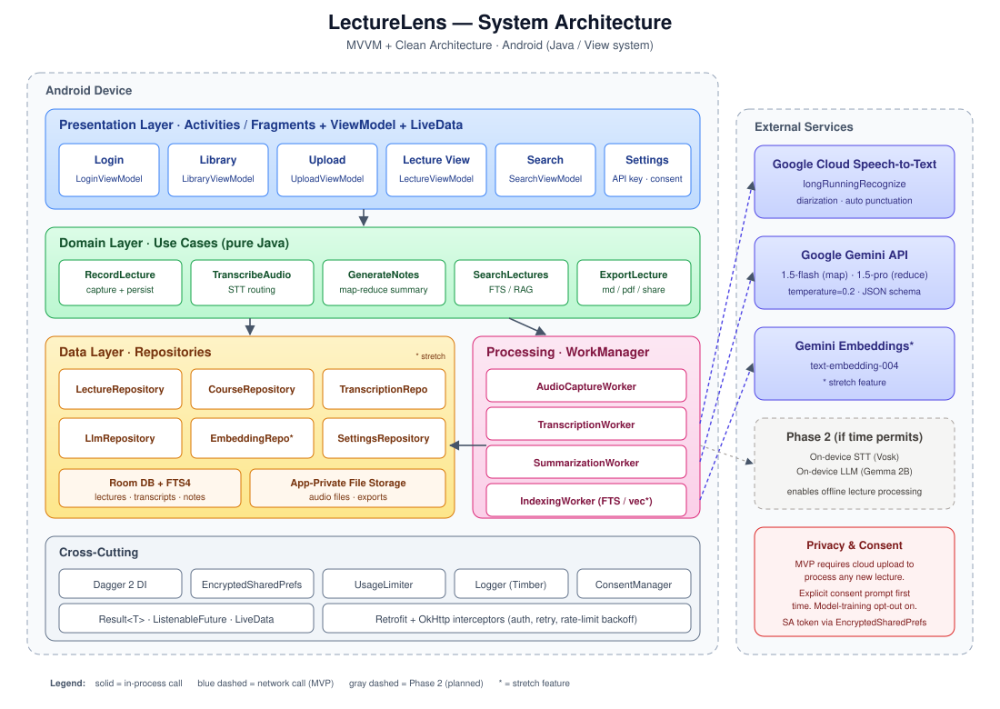

# LectureLens — Architecture Design

**Course:** CP-670 Android Application Programming
**Project:** LectureLens — Lecture to Notes Companion
**Date:** June 2026
**Authors:** Daniel Monday-Ogidi, Adeniyi Ridwan Adetunji, Muhammad Umer Amir, Zeeshan Mahmood, Aaron Gullraiz Cecil

---

## 1. Overview

LectureLens is an Android application that turns lecture audio into searchable, well-structured notes. The architecture is organized in three layers — **Presentation**, **Domain**, and **Data** — following the Android-recommended **MVVM + Clean Architecture** pattern. Heavy work (transcription, summarization, embeddings) is delegated to a thin **Processing Layer** that calls Google cloud services through repository interfaces, so providers can be swapped without touching app logic.

**MVP scope:** all speech-to-text and notes generation run in the cloud via Google services (Cloud Speech-to-Text + Gemini). An internet connection is required to process a new lecture. Already-processed lectures, transcripts, and notes remain viewable offline because they're cached locally.

**Phase 2 (time permitting):** on-device transcription and summarization fallback for offline processing and stronger privacy. The repository interfaces are designed so this slots in without changes to the UI, domain, or data layers.

### 1.1 Architectural Goals

| Goal | How the architecture addresses it |
|---|---|
| Offline review (MVP) | Local Room DB stores transcripts, summaries, and audio paths so reads never require network. New-lecture processing does require network in the MVP. |
| Cloud reliability | Both STT and LLM run on Google's managed services — no on-device model footprint in the MVP. |
| Provider flexibility | All STT, LLM, and embedding calls go through repository interfaces, so an on-device or alternate provider can be added later without app-logic changes. |
| Long-lecture support | Background `WorkManager` jobs run map-reduce summarization in chunks. |
| Privacy & consent | Audio leaves the device for cloud processing — the user sees an explicit consent prompt before the first upload and a per-lecture indicator afterward. |
| Testability | Domain layer is pure Java with no Android dependencies; data sources are mockable behind interfaces. |

### 1.2 Technology Stack

The app targets Android 10+ (API 29) and is written in **Java** using the AndroidX View system (XML layouts + Fragments / Activities), **Dagger 2** for dependency injection, **Room** for local persistence, and **WorkManager** for background processing. Asynchronous work uses `ExecutorService` and Guava `ListenableFuture` (`androidx.concurrent:concurrent-futures`); reactive UI state is exposed via `LiveData`. **Google Cloud Speech-to-Text** handles all transcription and **Google Gemini** (via the Google AI / Vertex AI Java client) handles all summarization, note generation, and — for the stretch RAG feature — embeddings. There is no on-device transcription or LLM inference in the MVP. Retrofit + OkHttp wrap the REST calls, ExoPlayer handles audio playback, and the MediaRecorder API handles capture. FTS4 (built into SQLite) powers full-text search in the MVP, with an SQLite vector extension reserved for the stretch RAG feature.

---

## 2. High-Level Architecture



The system is split into four concerns:

**Presentation Layer (UI)** — Activities / Fragments with XML layouts (Login, Library, Upload, Lecture View, Search) backed by `androidx.lifecycle.ViewModel` classes that expose `LiveData<UiState>` to the UI. ViewModels never touch data sources directly; they call use cases. One-shot events (navigation, snackbars) flow through a `SingleLiveEvent` helper so they aren't re-emitted on configuration change.

**Domain Layer (Use Cases)** — Plain Java classes (no Android dependencies) that encapsulate one action each: `RecordLectureUseCase`, `TranscribeAudioUseCase`, `GenerateNotesUseCase`, `SearchLecturesUseCase`, `ExportLectureUseCase`. They orchestrate repositories and return `ListenableFuture<Result<T>>`, which keeps them unit-testable on the JVM.

**Data Layer (Repositories)** — `LectureRepository`, `CourseRepository`, `TranscriptionRepository`, `LlmRepository`, `EmbeddingRepository`. `LectureRepository` and `CourseRepository` are backed by Room; `TranscriptionRepository`, `LlmRepository`, and `EmbeddingRepository` are backed by Retrofit clients calling Google services. The interfaces leave room for an on-device implementation in Phase 2. A generic `Result<T>` class (sealed via `Success` / `Failure` subclasses) carries success and error states up the stack.

**Processing Layer (Background)** — `WorkManager` workers run the audio → transcript → summary → embeddings pipeline outside the UI lifecycle, so the user can leave the screen while a 90-minute lecture processes.

---

## 3. Detailed Component Design

### 3.1 Presentation Layer

```
ui/
├── auth/         LoginActivity, LoginViewModel               + activity_login.xml
├── library/      LibraryFragment, LibraryViewModel           + fragment_library.xml         (course/lecture list)
├── upload/       UploadFragment, UploadViewModel             + fragment_upload.xml          (record/import + progress)
├── lecture/      LectureViewActivity, LectureViewModel       + activity_lecture_view.xml    (player, transcript, notes)
├── search/       SearchFragment, SearchViewModel             + fragment_search.xml          (FTS + future RAG)
└── settings/     SettingsActivity                            + activity_settings.xml        (API key, consent, model)
```

Each ViewModel exposes a single `UiState` — modeled as an abstract base class with `Loading`, `Success`, and `Error` subclasses — observed by the Fragment / Activity via `liveData.observe(getViewLifecycleOwner(), this::render)`. One-shot events (navigation, snackbars) flow through a `SingleLiveEvent<T>` helper to avoid re-emission on configuration change.

### 3.2 Domain Layer

Use cases are the only place business rules live. For example, `GenerateNotesUseCase` decides whether a transcript is short enough for a single LLM call or needs hierarchical map-reduce. This keeps the rule in one place and out of the ViewModel.

```java
public class GenerateNotesUseCase {
    private static final int SINGLE_PASS_LIMIT = 3_000;

    private final LlmRepository llm;
    private final TranscriptChunker chunker;
    private final ListeningExecutorService executor;

    @Inject
    GenerateNotesUseCase(LlmRepository llm,
                        TranscriptChunker chunker,
                        @IoExecutor ListeningExecutorService executor) {
        this.llm = llm;
        this.chunker = chunker;
        this.executor = executor;
    }

    public ListenableFuture<Result<Notes>> execute(Transcript transcript) {
        return executor.submit(() -> {
            if (transcript.wordCount() <= SINGLE_PASS_LIMIT) {
                return llm.summarize(transcript.text()).get();
            } else {
                return mapReduceSummarize(transcript);
            }
        });
    }
}
```

### 3.3 Data Layer

**Room schema (MVP):**

| Table | Key columns |
|---|---|
| `courses` | id, name, color, created_at |
| `lectures` | id, course_id (FK), title, date, audio_path, duration_ms, status |
| `transcripts` | lecture_id (FK), full_text, language, model_used |
| `transcript_segments` | id, lecture_id (FK), start_ms, end_ms, text |
| `notes` | lecture_id (FK), summary, key_terms (JSON), action_items (JSON) |
| `transcripts_fts` | virtual FTS4 table mirroring transcript text for search |
| `embeddings` *(stretch)* | chunk_id, lecture_id, vector (BLOB), text |

`status` on `lectures` is an enum (`RECORDED`, `TRANSCRIBING`, `TRANSCRIBED`, `SUMMARIZING`, `READY`, `FAILED`) so the UI can show per-lecture progress on the library screen.

**Repository pattern:**

```java
public interface TranscriptionRepository {
    ListenableFuture<Result<Transcript>> transcribe(File audio, TranscribeOptions options);
}

public class GoogleCloudTranscriptionRepository implements TranscriptionRepository { ... }
// public class OnDeviceTranscriptionRepository implements TranscriptionRepository { ... }  // Phase 2
```

In the MVP, the Dagger 2 graph binds `TranscriptionRepository` directly to `GoogleCloudTranscriptionRepository` via an `@Binds` method in a `@Module`. A `TranscriptionRouter` is reserved for Phase 2, when an on-device implementation is added — at that point the router picks the implementation based on user setting and connectivity, and the change is contained in the DI module.

### 3.4 Processing Layer (Pipeline)


The pipeline runs as a chain of `WorkManager` workers so each stage is retryable, cancellable, and survives process death.

1. **AudioCaptureWorker** — writes a FLAC/AAC file to app-private storage, inserts a `lectures` row with status `RECORDED`.
2. **TranscriptionWorker** — requires network. Uploads the audio to a private Cloud Storage bucket and calls Cloud Speech-to-Text's `longRunningRecognize` (which supports lectures up to ~8 hours), polling the returned operation until results land. The response is persisted as timestamped `transcript_segments` with speaker tags when diarization is enabled.
3. **SummarizationWorker** — requires network. Runs the map-reduce flow against Gemini: each ~3k-token transcript chunk is summarized in parallel by `gemini-1.5-flash` (map), partial summaries are merged and re-summarized by `gemini-1.5-pro` (reduce), and a separate extraction pass pulls key terms and action items so they're not lost in the final compression. Gemini's structured-output / JSON-schema mode enforces the response shape.
4. **IndexingWorker** — runs locally. Writes transcript text into the `transcripts_fts` virtual table. Stretch: also computes Gemini embeddings (`text-embedding-004`) and writes the `embeddings` table.

Network-dependent workers are enqueued with `Constraints.Builder().setRequiredNetworkType(CONNECTED).build()`, so if the device is offline the pipeline pauses cleanly and resumes when connectivity returns instead of failing the lecture.

Each worker reports progress via `setProgressAsync()`, which the ViewModel observes through `WorkManager.getWorkInfoByIdLiveData()` to drive the upload-screen progress bar.

### 3.5 External Integrations

| Service | Purpose | Phase 2 fallback (time permitting) |
|---|---|---|
| Google Cloud Speech-to-Text | Speech-to-text (`longRunningRecognize`, auto-punctuation, diarization) | Android `SpeechRecognizer` / Vosk (on-device) |
| Google Gemini API (`gemini-1.5-flash` for chunks, `gemini-1.5-pro` for final reduce) | Summaries, key terms, action items, RAG answers | On-device small LLM (e.g., Gemma 2B via MediaPipe LLM Inference) |
| Gemini Embeddings API (`text-embedding-004`) *(stretch)* | Vector embeddings for semantic search | On-device sentence-transformer (e.g., MiniLM via TFLite) |

The "Phase 2 fallback" column is what the repository interfaces enable later — none of it ships in the MVP. The MVP requires network connectivity for any new lecture to be processed.

All external calls go through two Retrofit interfaces — `SpeechToTextService` and `GeminiService` — each provided by a Dagger 2 `@Module` with its own OkHttp client. A single `GoogleAuthInterceptor` fetches and refreshes the OAuth 2.0 access token (or attaches an API key for the AI Studio Gemini endpoint), and a shared `RateLimitInterceptor` handles 429/quota backoff. Credentials are stored in `EncryptedSharedPreferences`; for Cloud Speech-to-Text, the recommended flow is a service-account JSON exchanged for short-lived tokens rather than embedding the raw key in the APK.

---

## 4. Key Data Flows

### 4.1 Recording a New Lecture

User taps record → `UploadViewModel.startRecording()` → `RecordLectureUseCase` → `MediaRecorder` writes to file → on stop, `WorkManager.beginWith(transcription).then(summarization).then(indexing).enqueue()`. The user can navigate away; the library screen shows the lecture with a live status badge driven by `WorkInfo` exposed as `LiveData`.

### 4.2 Search (MVP)

User types query → `SearchViewModel` debounces 300 ms (via a `Handler` posted with `postDelayed`, cancelled on each new keystroke) → `SearchLecturesUseCase` calls `LectureRepository.search(query)` → SQLite FTS4 `MATCH` query returns hits with snippets → results render with lecture title, timestamp, and matched excerpt. Tapping a result starts `LectureViewActivity` with the matched timestamp passed as an `Intent` extra.

### 4.3 Question Answering (Stretch — RAG)

User asks a question → `AskQuestionUseCase` → `EmbeddingRepository.embed(query)` via Gemini `text-embedding-004` → vector search over `embeddings` table returns top-k chunks → chunks + question + system prompt sent to Gemini (`gemini-1.5-pro`) with low temperature and a JSON response schema → answer rendered with inline citations (lecture name + timestamp) pulled from the retrieved chunks' metadata. If retrieval confidence is below a threshold, the UI shows "I couldn't find this in your lectures" instead of letting the model guess.

---

## 5. Cross-Cutting Concerns

**Error handling.** Every repository returns `ListenableFuture<Result<T>>` where `Result<T>` is a sealed-style hierarchy (`Result.Success<T>`, `Result.Failure`). ViewModels translate errors into user-facing strings via a `StringResolver` so messages are testable and localizable.

**Concurrency.** A single `@IoExecutor`-qualified `ListeningExecutorService` (backed by a bounded thread pool) handles all I/O and repository work; UI updates are marshalled onto the main thread either through `LiveData.postValue()` or `new Handler(Looper.getMainLooper())`. WorkManager workers extend `androidx.work.Worker` and run on WorkManager's own executor; cancellation is handled by `WorkManager.cancelWorkById()` plus checking `isStopped()` in long loops.

**Security & privacy.** API keys and the Google Cloud service-account token live in `EncryptedSharedPreferences`. Audio files are stored in app-private storage (not accessible to other apps). A consent `AlertDialog` appears the first time a user starts cloud transcription, and a per-lecture indicator shows that audio was uploaded.

**Testing.** Domain use cases are JVM-unit-tested with JUnit 4 + Mockito; `ListenableFuture` results are awaited with `MoreExecutors.directExecutor()` in tests. Repository tests run against an in-memory Room database. Espresso UI tests cover the upload → library → lecture-view happy path. WorkManager has a dedicated test harness (`WorkManagerTestInitHelper`) for the pipeline workers.

**Telemetry.** A `Logger` interface wraps Android's `Log` (with Timber as an optional implementation if added later) so logs can be redirected; no PII or audio content is ever logged.

---

## 6. Module Structure

A multi-module Gradle setup keeps build times manageable and enforces the layering:

```
app/                 Application class, Dagger graph, navigation
:feature:library     Library Fragment + ViewModel
:feature:upload      Upload Fragment + ViewModel
:feature:lecture     Lecture View Activity + ViewModel
:feature:search      Search Fragment + ViewModel
:domain              Use cases, domain models (pure Java, no Android deps)
:data                Repositories, Room, Retrofit network clients
:processing          WorkManager workers, chunking, map-reduce
:core:ui             Shared View components, theme, custom Views
:core:common         Result type, ListenableFuture helpers, executor providers
```

The `:domain` module is plain Java with no Android dependencies, which is what makes the use-case layer trivially unit-testable on a desktop JVM with JUnit + Mockito.

---

## 7. Roadmap Mapping to Architecture

| Phase | Features | Architectural surface |
|---|---|---|
| MVP | Record/import, cloud transcription (Google STT), cloud notes (Gemini), library, FTS search, export, consent UX | Presentation + Domain + Data + Processing — all generation cloud-only |
| Phase 2 *(time permitting)* | On-device STT fallback, on-device LLM fallback, long-lecture map-reduce refinements | `TranscriptionRouter` + on-device implementations of `TranscriptionRepository` and `LlmRepository`, settings toggle |
| Stretch | Semantic search, RAG Q&A, cloud sync | `:data:embeddings` module, `AskQuestionUseCase`, optional sync service |

The Phase 2 work is purely additive: the MVP ships fully cloud-based, and on-device implementations slot in behind the existing repository interfaces with no changes to ViewModels or use cases. Cloud sync, if added, plugs in the same way.

---

## 8. Risks the Architecture Addresses

The biggest risks called out in the proposal — cost overruns, privacy concerns, long-audio limits, connectivity, and vendor lock-in — are all handled at the architecture boundary rather than scattered through the code. Cost limits live in a single `UsageLimiter` consulted before any cloud call (per-day token and per-minute audio caps for Gemini and Cloud Speech-to-Text respectively). Privacy is addressed by a Google Cloud project under the team's control with model-training opt-out enabled, plus an explicit per-user consent prompt before the first cloud upload. Long audio uses Cloud Speech-to-Text's `longRunningRecognize` operation via a GCS-staged URI, so file-size limits are no longer a blocker. The MVP's hard network requirement is mitigated by WorkManager constraints (work pauses cleanly until connectivity returns) and by the Phase 2 on-device fallback. Lock-in is mitigated by the repository interfaces — adding on-device, switching to Whisper/GPT, or moving to Claude is a DI-graph change, not an app rewrite.

---

## 9. AI Usage

This section documents how AI is used both *inside* LectureLens and *during* its development, so reviewers can evaluate it against course academic-integrity policy and so future maintainers understand what is generated vs. authored.

### 9.1 AI Used Inside the Product

LectureLens is, by design, an AI-powered application. Two Google services do the substantive work:

| Capability | Service | Model | Where it appears |
|---|---|---|---|
| Speech-to-text | Google Cloud Speech-to-Text | `latest_long` recognizer (auto-punctuation, speaker diarization) | `TranscriptionWorker` (§3.4) |
| Per-chunk summary (map) | Google Gemini API | `gemini-1.5-flash` | `SummarizationWorker`, map stage (§3.4) |
| Final summary (reduce) | Google Gemini API | `gemini-1.5-pro` | `SummarizationWorker`, reduce stage (§3.4) |
| Key terms + action items | Google Gemini API | `gemini-1.5-flash` | `SummarizationWorker`, extraction pass (§3.4) |
| Question answering *(stretch)* | Google Gemini API | `gemini-1.5-pro` | `AskQuestionUseCase` (§4.3) |
| Embeddings *(stretch)* | Google Gemini API | `text-embedding-004` | `EmbeddingRepository` (§4.3) |

**Guardrails on AI output.** Generated content is never presented as ground truth from the lecturer. Specifically:

- Every summary is rendered alongside the source transcript so the user can verify any claim against the recorded audio.
- RAG answers (stretch) always include lecture-name + timestamp citations; tapping a citation opens the relevant transcript section. Low-confidence retrievals show "I couldn't find this in your lectures" instead of guessing.
- The Gemini system prompt fixes the role as a *study-notes assistant* and instructs the model to not invent content beyond the supplied transcript. Temperature is set to 0.2 for consistency.
- JSON-schema response mode enforces the output shape, so malformed responses fail fast rather than producing partial UI rendering.

**User consent and data handling.** Audio leaves the device only after the user accepts an explicit consent prompt. The Google Cloud project is configured with the model-training opt-out enabled on both Speech-to-Text and Gemini, and audio objects in the staging GCS bucket are deleted by `TranscriptionWorker` immediately after the transcript is persisted. A per-lecture indicator in the UI shows that the audio was processed in the cloud.

**Cost and rate-limit handling.** A `UsageLimiter` (see §8) enforces per-day token and per-minute audio caps so a runaway loop cannot drain the team's quota.

### 9.2 AI Used During Development

Generative AI assistants (specifically, Anthropic's Claude) were used by the team to accelerate parts of the design and documentation work. The intent is to be transparent about where AI helped and where the team owns the judgment.

**Where AI assistance was used:**

- Drafting the structure and prose of this architecture document.
- Generating initial versions of the SVG architecture diagrams and the PlantUML state / activity / sequence diagrams in `diagrams/`.
- Suggesting boilerplate code patterns (e.g., the `ListenableFuture`-returning use-case skeleton in §3.2, the Dagger `@Module` style in §3.5, the Room schema layout in §3.3).
- Drafting comparison tables (e.g., the STT-options table in the proposal, the Phase 2 fallback column in §3.5).
- Editing and re-styling existing diagrams to match academic UML conventions.

**Where the team owns the work:**

- All requirements, scope, and stakeholder analysis (from the original proposal).
- The decision to use Google Cloud Speech-to-Text and Google Gemini (rather than alternatives).
- The decision to defer on-device processing to Phase 2 and ship a cloud-only MVP.
- The choice of Java + View system + Dagger 2 over Kotlin + Compose + Hilt.
- All review, validation, and final approval of every AI-suggested artifact before it was included in the project.
- The actual implementation of the Android app — production code is written and reviewed by the team. AI-suggested snippets in this document are illustrative; they are not copied verbatim into the codebase without review and adaptation.

**Verification practices.**

- Every AI-generated code snippet is read line-by-line by at least one team member before commit. Snippets that reference Android APIs are checked against the current AndroidX documentation.
- AI-suggested architectural claims (e.g., "Cloud Speech-to-Text supports up to ~8 hours via `longRunningRecognize`") are cross-checked against Google's official documentation.
- Test code is written by the team, not generated, so the test suite acts as an independent check on the implementation.

**What AI was *not* used for.**

- Generating final production code without human review.
- Answering questions on behalf of users inside the app (the only model-facing conversations are summarization and the stretch RAG Q&A — both grounded in the user's own lectures, not in arbitrary world knowledge).
- Grading, evaluation, or any other use that would conflict with course policy.

If course policy requires per-deliverable AI-use statements, this section should be cited and a short addendum added to each deliverable indicating which subset of the practices above applied.

---

## 10. Project Links

| Resource | URL |
|---|---|
| Repository (root) | [github.com/umeraamir69/Android-project](https://github.com/umeraamir69/Android-project) |
| Design doc — `main` branch | [LectureLens_Architecture.md @ main](https://github.com/umeraamir69/Android-project/blob/main/docs/LectureLens_Architecture.md) |
| Design doc — `feat/pure-java-conversion` branch (Kotlin removed) | [LectureLens_Architecture.md @ feat/pure-java-conversion](https://github.com/umeraamir69/Android-project/blob/feat/pure-java-conversion/docs/LectureLens_Architecture.md) |

> **Note for the instructor — repository access.** The repository is currently private. To grant access for grading and review, please share your GitHub username with the team and we will add you as a collaborator.
